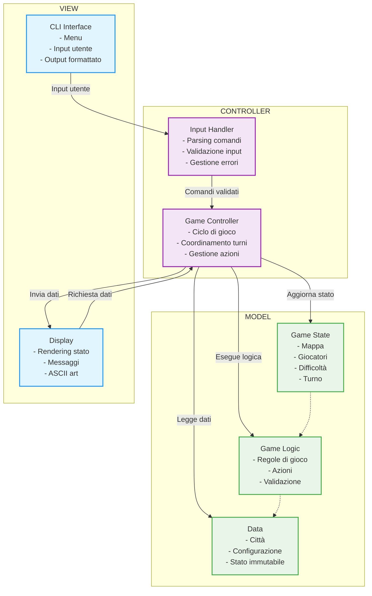

# Design di Dettaglio

## Design del Model
Il model rappresenta la logica di gioco, le sue regole, lo stato e l'evoluzione complessiva. Il suo design è 
fortemente incentrato sui principi della programmazione funzionale e sull’immutabilità, garantendo prevedibilità e 
consistenza dello stato di gioco. Ogni modifica allo stato o una sua componente restituisce una nuova istanza 
preservando anche la lista degli stati precedenti.

1) Lo stato globale del gioco è gestito da un componente centrale che incapsula la mappa, i giocatori, 
la difficoltà e il turno. Per proteggere la sua struttura interna è stato implementato come opaque types e 
permette l’accesso solo tramite i metodi di estensione.
2) Le azioni sono fortemente tipate, in modo da essere sicuri che a compile-time si passi sempre l’azione giusta 
nel caso di AI o Human.

Tutte queste scelte contribuiscono a manutenibilità, estendibilità e testabilità.

## Design della View
La view si occupa di mostrare le informazioni di gioco al player e della raccolta dell’input. Il suo design è
stato pensato per essere disaccoppiato dalla logica di gioco, predispone i metodi al controller per la renderizzazione 
degli elementi di gioco.

1) Per garantire coerenza visiva e ridurre la duplicazione del codice, la view utilizza un modulo di Utils dedicato 
alla formattazione degli elementi stilizzati come menù, blocchi informativi e titoli in ASCII art.

Questo design supporta l’usabilità fornendo un’interfaccia chiara e interattiva.

## Design del Controller
Il GameController rappresenta il fulcro della logica applicativa, responsabile della gestione dell’intero ciclo di gioco.
Inizializza i componenti principali, coordina le interazioni tra model e view, e gestisce l’alternanza dei turni (prima
l’azione dell’IA, seguita da quella dell’utente).
L’intero flusso di gioco è modellato in modo funzionale e immutabile tramite la monade State, che permette di mantenere
e aggiornare lo stato globale del gioco senza effetti collaterali, favorendo così una maggiore prevedibilità e facilità 
di test.
Il componente InputHandler è incaricato di interpretare e validare gli input provenienti dall’interfaccia utente. 
Si occupa di trasformare tali input in azioni concrete, verificando la correttezza semantica delle scelte e gestendo 
eventuali errori di parsing o input non validi.
Il design modulare e funzionale del controller è fondamentale per garantire la robustezza, la manutenibilità e 
la testabilità del sistema.

