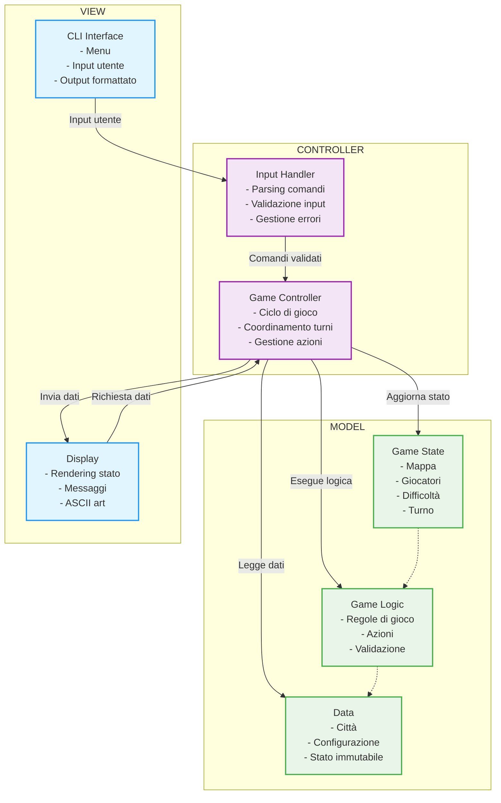

# Design di Dettaglio

## **Design del Model**

Il **Model** rappresenta il cuore logico del gioco, articolato in più moduli che riflettono le entità fondamentali del dominio: mappa, giocatori, città, azioni e stato del gioco. Ciascuna entità è modellata come un componente indipendente ma interconnesso, con interfacce ben definite per promuovere modularità e coerenza.

* **WorldState** funge da aggregatore centrale dell’intero stato del gioco. Mette in relazione la mappa, i giocatori (umano e IA), il livello di difficoltà e il turno corrente, coordinando l’evoluzione dello stato durante la partita. Le sue dipendenze sono distribuite su entità come *WorldMap*, *PlayerHuman*, *PlayerAI* e *Difficulty*.

* **WorldMap** e **CityModule** gestiscono la rappresentazione territoriale del mondo di gioco. La mappa è composta da città disposte su coordinate, e ogni città è associata a un proprietario (umano o IA), con attributi come dimensione, capitale e difesa. La relazione tra città e coordinate costruisce la geografia strategica della partita.

* I moduli **PlayerHuman** e **PlayerAI** rappresentano le due tipologie di giocatori, con ruoli e comportamenti differenziati. Entrambi interagiscono con lo stato globale tramite azioni (es. difesa, sabotaggio, evoluzione), che a loro volta influenzano la mappa e le città controllate. Queste entità condividono una gerarchia comune (es. *PlayerEntity*), garantendo uniformità nell'interfaccia e nella gestione delle azioni.

* Le **azioni di gioco** (modelli come *TurnAction*, *AiAction*) costituiscono un layer di astrazione che collega le scelte strategiche dei giocatori con le modifiche allo stato del gioco. Le entità coinvolte sono quindi non solo il giocatore, ma anche il contesto (es. città bersaglio, parametri ambientali), creando un flusso dinamico di interazioni.

    
## Design della View
La view si occupa di mostrare le informazioni di gioco al player e della raccolta dell’input. Il suo design è
stato pensato per essere disaccoppiato dalla logica di gioco, predispone i metodi al controller per la renderizzazione 
degli elementi di gioco.

1) Per garantire coerenza visiva e ridurre la duplicazione del codice, la view utilizza un modulo di Utils dedicato 
alla formattazione degli elementi stilizzati come menù, blocchi informativi e titoli in ASCII art.

Questo design supporta l’usabilità fornendo un’interfaccia chiara e interattica.

## **Design del Controller**

Il **Controller** agisce da coordinatore centrale, gestendo il flusso del gioco e orchestrando le interazioni tra Model e View.

* Il componente **GameController** stabilisce la sequenza dei turni, l’inizializzazione del mondo e la propagazione delle azioni. Ogni azione dell’utente viene catturata e tradotta in modifiche allo stato, attraverso una catena di trasformazioni ben definite.

* Il modulo **InputHandler** è dedicato alla gestione dell’input utente, con meccanismi di validazione e interpretazione contestuale. Insieme alle entità *InputHandling* e *ActionContext*, forma un ecosistema di trasformazione semantica delle intenzioni dell’utente in azioni concrete all’interno del sistema.  

