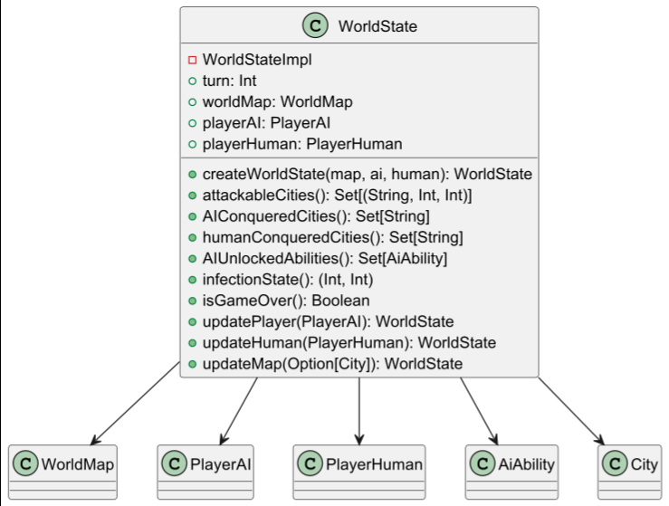
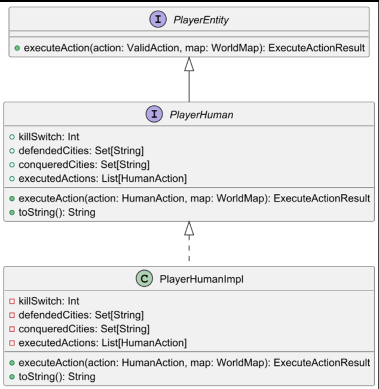
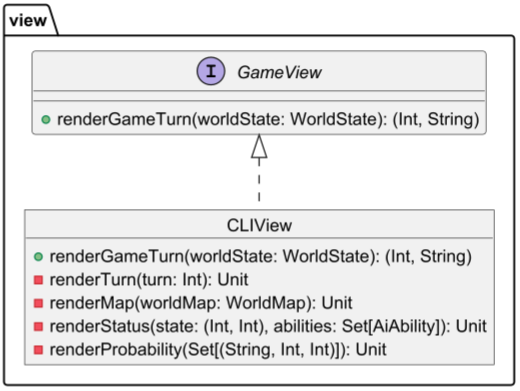

# WorldState
Il modulo `WorldState` rappresenta lo stato globale del gioco ad un dato turno.  
È progettato in stile **funzionale** e **immutabile** usando `opaque type`, e fornisce un'interfaccia 
pubblica attraverso metodi di estensione (`extension`).

## Componenti principali

- **WorldMap**: la mappa di gioco con le città
- **PlayerAI**: il giocatore controllato dalla CPU
- **PlayerHuman**: il giocatore umano
- **Turn**: intero che rappresenta il numero di turno corrente

## Funzionalità esposte

### Costruttore
```scala
def createWorldState(worldMap: WorldMap, playerAI: PlayerAI, playerHuman: PlayerHuman): WorldState
```
- turn -> Restituisce il numero del turno attuale
- worldMap ->	Restituisce la mappa attuale
- playerAI, playerHuman	-> Restituiscono i dati dei giocatori
- attackableCities -> Restituisce le città attaccabili e le probabilità di successo
- AIConqueredCities, humanConqueredCities -> Restituisce le città conquistate da ciascun giocatore
- infectionState -> Restituisce stato dell'infezione: (infette, totali)
- isGameOver -> Determina se il gioco è terminato
- updatePlayer, updateHuman, updateMap -> Restituiscono un nuovo WorldState aggiornato

## Dettagli implementativi
//TODO


---
# PlayerHuman

# `PlayerHuman` – Documentazione

## 📘 Descrizione

Il modulo `PlayerHuman` rappresenta il giocatore umano nel gioco.  
È progettato per essere **immutabile**, **tipato in modo sicuro**, e conforme a una gerarchia funzionale basata sul trait `PlayerEntity`.

## Componenti principali
- `PlayerHuman` è un trait che definisce il comportamento pubblico del giocatore umano.
- `PlayerHumanImpl` è l'implementazione privata, non accessibile dall'esterno.
- Azioni eseguibili: `CityDefense`, `GlobalDefense`, `DevelopKillSwitch`.

## Campi principali
| Campo | Tipo | Descrizione |
|-------|------|-------------|
| `killSwitch` | `Int` | Stato di avanzamento dello sviluppo del kill switch |
| `defendedCities` | `Set[String]` | Città attualmente difese |
| `executedActions` | `List[HumanAction]` | Storico delle azioni eseguite |
| `conqueredCities` | `Set[String]` | (Opzionale) Città conquistate dal giocatore |

## Funzionalità principali
| Metodo | Descrizione |
|--------|-------------|
| `executeAction(action, worldMap)` | Esegue un'azione umana sullo stato attuale |
| `addAction(action)` | Metodo interno per aggiornare la lista delle azioni eseguite |
| `toString()` | Rende lo stato del giocatore umano formattato in output leggibile |

## Comportamento `executeAction`

### Azione `CityDefense`
- Aggiunge le città target a `defendedCities`
- Aggiorna `executedActions`
- Modifica la città nella mappa (se trovata)

### Azione `GlobalDefense`
- Aggiunge target a `defendedCities`
- Nessuna modifica sulla mappa (per il momento) andrà implementata

### Azione `DevelopKillSwitch`
- Incrementa il valore `killSwitch`

## Dettagli implementativi

//TODO


---

# HumanAction

---

# ViewModule

Il modulo `ViewModule` gestisce la visualizzazione dello stato del gioco.  
In questa implementazione è presente una **interfaccia `GameView`** e 
una **concreta `CLIView`** che stampa il gioco su terminale.

## Componenti principali

- `GameView`: trait che definisce il metodo `renderGameTurn`
- `CLIView`: implementazione console che mostra:
    - Turno attuale
    - Mappa
    - Stato infezione
    - Probabilità di attacco
    - Menu di scelta azioni

## Funzionalità esposte

| Metodo | Descrizione |
|--------|-------------|
| `renderGameTurn` | Chiama in sequenza i vari metodi di rendering e ritorna una scelta dell'utente |
| `renderTurn` | Mostra il numero del turno |
| `renderMap` | Visualizza la mappa in formato testuale |
| `renderStatus` | Mostra percentuale di infezione e abilità AI sbloccate |
| `renderProbability` | Stampa le città attaccabili con percentuali |
| `renderActionMenu` | Chiede all'utente di inserire l'azione da eseguire (es. `1 A`) |

## Dettagli implementativi

//TODO 



### Output di `renderGameTurn`
```
-----RISE OF THE MACHINE - TURN 0-----

t | O O O q q x N r
t O O O O O q N N N
t t j O L L L N N N
t j j j L L L L M M
s s h p L k L M M M
s s h h k k k M M M
v b h h i i { g u u
b b b i i i f g u u
C a d d d f f g w w
C a a e e e e z w y
Infected city: 0/28 --> 0.00,00%

0 abilities unlocked

cities probability:  [L --> 65%, 20%] [f --> 95%, 50%] [j --> 90%, 45%] [| --> 95%, 50%] [{ --> 85%, 40%] 
[i --> 85%, 40%] [x --> 90%, 45%] [y --> 85%, 40%] [h --> 85%, 40%] [g --> 95%, 50%] [t --> 85%, 40%] 
[b --> 90%, 45%] [v --> 95%, 50%] [d --> 95%, 50%] [s --> 90%, 45%] [M --> 70%, 25%] [N --> 75%, 30%] 
[r --> 85%, 40%] [O --> 65%, 20%] [u --> 90%, 45%] [p --> 85%, 40%] [q --> 95%, 50%] [e --> 90%, 45%] 
[w --> 95%, 50%] [z --> 95%, 50%] [C --> 70%, 25%] [a --> 95%, 50%] [k --> 90%, 45%]

Select your action:
0. Sabotage
1. Infect
2. Evolve
Insert your action > 
```
---

