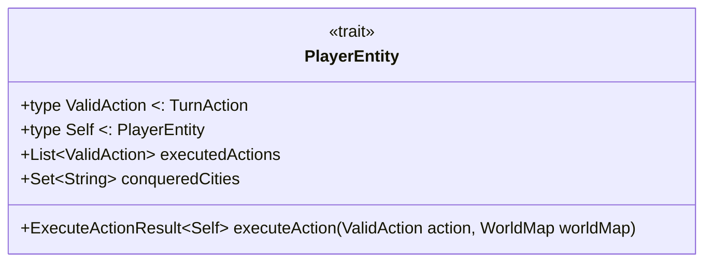
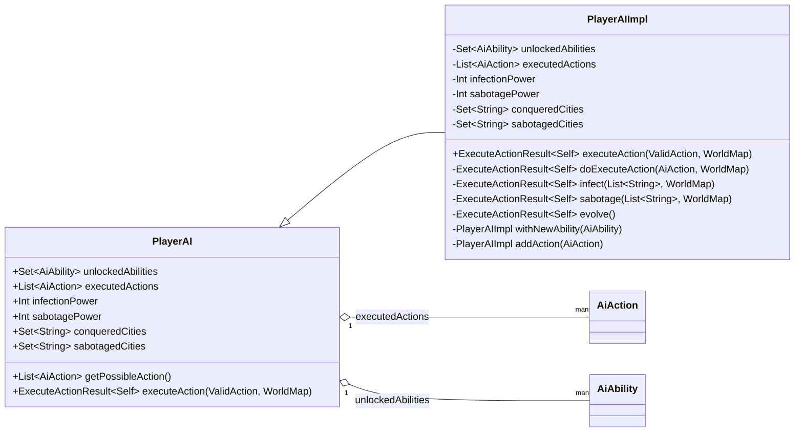
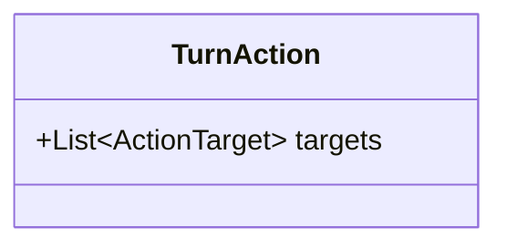
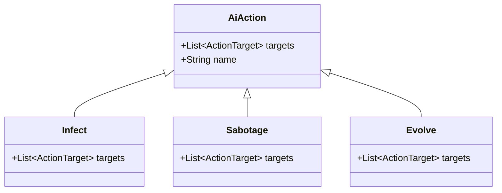
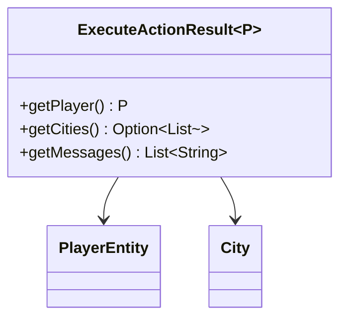
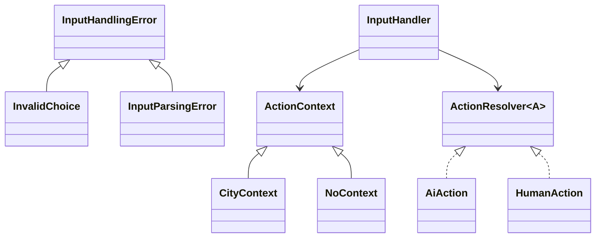

# Intro

Questa sezione contiene la descrizione delle classi da me implementate durante lo sviluppo del progetto.
Mi sono occupato principalmente di:

* **`model.strategy`**: Definisce i comportamenti astratti e concreti delle azioni disponibili per Human e IA, tramite trait come `TurnAction`, `AiAction`, `HumanAction`, e le loro rispettive implementazioni (`Infect`, `Sabotage`, `CityDefense`, ecc.).

* **`model.util`**: Contiene la configurazione globale del gioco tramite `GameSettings`, compresi i parametri basati su modalità di gioco (`Single Player`, `Multiplayer`) e difficoltà (`Easy`, `Normal`, `Hard`).

* **`controller`**: Gestisce l'interazione tra l’utente e il sistema. Fornisce il parsing dell’input, la risoluzione delle azioni tramite contesto e la gestione degli errori (`InputHandler`, `InputHandlingError`, ecc.).

# Model

## PlayerEntity

**Link al codice** *da inserire manualmente*

**Descrizione:**

`PlayerEntity` è un trait che rappresenta qualsiasi entità giocante all'interno del progetto, come un giocatore umano o un'intelligenza artificiale. Questa classe fa parte del package `model` ed è utilizzata per modellare il comportamento di un giocatore che può eseguire azioni durante il gioco.
 La scelta di usare un trait parametrizzato tramite tipi associati (`ValidAction` e `Self`) permette una forte tipizzazione e flessibilità, garantendo che le azioni eseguite siano compatibili con la specifica entità.

**Caratteristiche funzionali:**

* **Tipi associati (`ValidAction` e `Self`)**: permettono di definire in modo generico quali azioni sono valide per una specifica entità e di mantenere il tipo dell'entità stessa durante l'esecuzione delle azioni.
  *Vantaggi:* forte sicurezza di tipo e possibilità di estendere facilmente il comportamento con nuove entità e azioni senza modificare il trait base.
* **Metodo `executeAction`**: esegue un'azione valida sul mondo di gioco aggiornando lo stato dell'entità e restituendo un risultato che indica l'esito.
  *Vantaggi:* incapsula la logica di mutazione dell'entità e il possibile effetto sull'ambiente di gioco, permettendo di mantenere immutabilità e di usare pattern funzionali per la gestione dello stato.

**Diagramma Mermaid della classe**

## PlayerAI

**Link al codice:** *(da inserire manualmente)*

**Descrizione:**
`PlayerAI` rappresenta il giocatore controllato dall'intelligenza artificiale nel gioco. Gestisce l'esecuzione di azioni specifiche come infezioni, sabotaggi e evoluzioni. Implementa il pattern **trait con case class immutabile** per separare l'interfaccia dalla sua implementazione, favorendo estendibilità e testabilità. Utilizza inoltre il pattern **companion object** per la costruzione istanze tramite parametri impliciti (type class pattern per la configurazione).

**Caratteristiche funzionali:**

* **Immutabilità:** Tutti gli stati sono gestiti tramite case class immutabili (`PlayerAIImpl`), permettendo uno stato prevedibile e thread-safe.
* **Purezza delle funzioni:** Le azioni ritornano nuovi stati senza effetti collaterali, favorendo reasoning semplice e testabilità.
* **Uso di tipi alias:** per `ValidAction` e `Self`, migliorando la chiarezza e la riusabilità del codice.
* **Funzioni di alto livello:** `executeAction` e `getPossibleAction` operano sullo stato e sulle azioni, isolando la logica di business in funzioni pure.
* **Uso di pattern matching:** per dispatch dinamico delle azioni AI (`Infect`, `Sabotage`, `Evolve`), chiaro e conciso.
* **Uso di impliciti e given:** per parametri di configurazione, rendendo il codice più flessibile e pulito senza passare esplicitamente i parametri.
* **Funzioni funzionali per trasformazioni:** uso di combinatori come `map`, `flatMap`, `pipe` (da `scalaUtilChainingOps`), e `fold` per manipolazione pulita dei dati.
* **Vantaggi:**

  * Stato sempre aggiornato e coerente, grazie all’immutabilità.
  * Separazione netta tra interfaccia e implementazione.
  * Estendibilità per future abilità o azioni AI.
---

**Diagramma mermaid della classe:**

---

## TurnAction

**Link al codice:** *(da inserire manualmente)*

**Descrizione:**
`TurnAction` rappresenta un'astrazione funzionale delle azioni che possono essere eseguite durante un turno di gioco. Definisce un'interfaccia semplice che espone i target su cui l'azione opera. Il tipo alias `ActionTarget` indica gli obiettivi di queste azioni (attualmente una stringa, ma potrebbe essere esteso in futuro per aumentare la robustezza del sistema). Il pattern utilizzato è quello di un **trait funzionale semplice con factory method nel companion object**, che facilita la creazione di istanze anonime e immutabili.

**Caratteristiche funzionali:**

* **Immutabilità e semplicità:** `TurnAction` è un trait con un unico metodo `targets` che restituisce i target dell’azione, mantenendo la struttura leggera e facile da estendere.
* **Factory method funzionale:** Il companion object offre un metodo `apply` che permette di creare facilmente istanze di `TurnAction` tramite una funzione anonima (anonimo class instance), semplificando la costruzione senza bisogno di classi concrete separate.
* **Tipo alias per target:** `ActionTarget` definito come `String` ma con possibilità di miglioramento futura per tipi più forti o complessi.
* **Vantaggi:**

  * Facilità d’uso e estensibilità: chiunque può creare nuove azioni senza definire nuove classi.
  * Coerenza: tutte le azioni espongono lo stesso metodo `targets`, facilitando il trattamento uniforme in tutta l'applicazione.
  * Incapsulamento pulito dei dati relativi ai target.

---

**Diagramma mermaid della classe:**

---

## AiAction

**Link al codice:** *(da inserire manualmente)*

**Descrizione:**
`AiAction` è un trait sealed che rappresenta le azioni specifiche eseguibili dal playerAI nel gioco. Estende `TurnAction` e definisce tre tipi concreti di azioni: `Infect`, `Sabotage` e `Evolve`. Il pattern utilizzato è il **sealed trait con case class e case object**, che permette di definire un insieme chiuso di azioni possibili, garantendo sicurezza a compile-time e permettendo pattern matching esaustivo.

**Caratteristiche funzionali:**

* **Sealed trait e case class/object:** Definisce un insieme finito e noto di azioni AI, permettendo al compilatore di controllare i casi trattati.
* **Immutabilità:** Le azioni sono rappresentate da case class immutabili o case object per azioni senza parametri.
* **Polimorfismo tramite pattern matching:** Il metodo `name` usa pattern matching sull'istanza per restituire un nome descrittivo, mantenendo una logica chiara e dichiarativa.
* **Factory methods nel companion object:** Permettono di creare facilmente istanze di azioni, mantenendo il codice client pulito e chiaro.
* **Vantaggi:**

  * Facilita l’estensione futura solo aggiungendo nuovi case class nel trait sealed.
  * Sicurezza e chiarezza nella definizione delle azioni AI possibili.
---

**Diagramma mermaid della classe:**

---

## ExecuteActionResult

**Link al codice:** *(da inserire manualmente)*

**Descrizione:**
`ExecuteActionResult` è un tipo opaco che incapsula il risultato dell’esecuzione di un’azione di gioco effettuata da un’entità giocatore. Rappresenta una tripla contenente:

1. il nuovo stato del giocatore (`PlayerEntity`),
2. un'opzionale lista di città coinvolte nell’azione,
3. e una lista di messaggi descrittivi.

---

**Caratteristiche funzionali:**

* **Opaque Type:** L'uso di un tipo opaco (`opaque type`) consente di nascondere l'implementazione interna.
* **Sicurezza dei tipi:** Il parametro di tipo `P <: PlayerEntity` rende la struttura riutilizzabile per qualsiasi tipo concreto di giocatore, preservando l'informazione statica sul tipo durante l'elaborazione.
* **Estensioni type-safe:** Le `extension methods` permettono un accesso elegante e leggibile ai campi senza rivelare la struttura interna della tupla.

* **Vantaggi:**

  * Incapsulamento forte grazie a opaque types.
  * Accesso controllato e leggibile tramite extension method.
  * Riutilizzabile e polimorfo grazie alla parametrizzazione con `P <: PlayerEntity`.

---

**Diagramma mermaid della struttura:**

---

## GameSettings

**Link al codice:** *(da inserire manualmente)*

**Descrizione:**
Il modulo `GameSettings` centralizza la configurazione generale del gioco, incapsulando le impostazioni legate alla difficoltà, alla modalità di gioco e ai parametri statistici per i giocatori IA e umani. Viene utilizzato un pattern modulare  per offrire configurazioni flessibili E riutilizzabili.

**Caratteristiche funzionali:**

* **Programmazione funzionale**:

  * Integrazione con il sistema di **typeclass implicite (`given`)**, per una Dependency Injection elegante e senza boilerplate.

* **Modularità e riusabilità**:

  * Le configurazioni sono mappate in base al livello di difficoltà con delle mappe (`aiConfigs`, `humanConfigs`), semplificando modifiche future o l'aggiunta di nuovi livelli.
Ecco la documentazione per il file `InputHandler.scala`:

---
# Controller

## InputHandler & InputHandling

**Link al codice:** *(da inserire manualmente)*

**Descrizione:**
Questo modulo si occupa della validazione e trasformazione delle scelte utente in azioni concrete di gioco, distinguendo tra azioni dell’IA (`AiAction`) e azioni umane (`HumanAction`). Gestisce errori di parsing input, scelte non valide e risoluzione di azioni tramite contesto.

---

## Pattern principali

| Pattern/Funzionalità             | Dettagli                                                                                                     |
| -------------------------------- | ------------------------------------------------------------------------------------------------------------ |
| **Typeclass (`ActionResolver`)** | Fornisce un'interfaccia generica per risolvere azioni da un contesto.                                        |
| **Impliciti (`given`)**          | Implementazioni fornite automaticamente per `AiAction` e `HumanAction`.                                      |
| **Error Handling**               | Usa un `sealed trait` per rappresentare gli errori (`InputHandlingError`) e fornisce messaggi utente chiari. |
| **Contextual Resolution**        | Le azioni vengono risolte a seconda del contesto fornito (`CityContext`, `NoContext`).                       |

---

## Comportamento dettagliato

### `InputHandlingError`

* **Scopi**: gestire errori durante il parsing input o selezione errata.
* **Tipi**:

  * `InvalidChoice`: scelta fuori intervallo.
  * `InputParsingError`: formato non valido.
* **Estensione**: `userMessage` fornisce messaggi user-friendly.

### `ActionContext`

Contesto usato per determinare la validità e l'applicazione dell'azione:

* `CityContext`: rappresenta un'azione riferita a una città specifica.
* `NoContext`: nessuna informazione disponibile.

### `ActionResolver[A]`

Typeclass che descrive come "completare" un’azione a partire da una sua forma base e un contesto.

### `getActionFromChoice`

Funzione generica che:

1. Valida l’indice di scelta.
2. Usa il `resolver` implicito per completare l’azione.

### Resolver impliciti

* **AI**:

  * `Infect`, `Sabotage`: solo se la città è nell’elenco delle città attaccabili.
  * `Evolve`: accettato senza contesto.
* **Human**:

  * `CityDefense`, `GlobalDefense`: solo se le città target sono valide.
  * `DevelopKillSwitch`: sempre valido.

---

**Punti di forza**
- Separazione chiara tra logica di input e logica di gioco
- Estendibilità tramite ActionResolver per supportare nuovi tipi di azione
- Messaggi di errore dettagliati e localizzati
- Uso corretto degli impliciti per evitare boilerplate
## Diagramma mermaid

