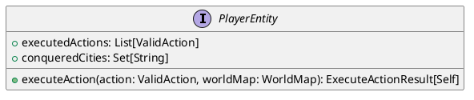
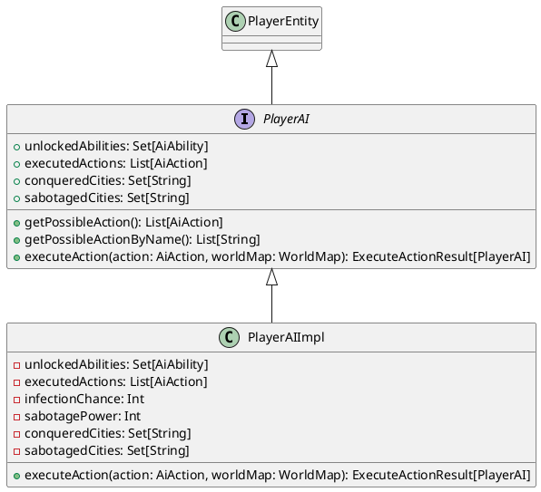
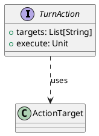
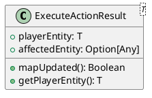
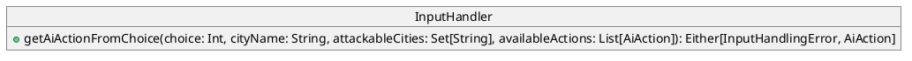

## PlayerEntity
[PlayerEntity.scala](https://github.com/GiammaCode/PPS-25-RiseOfTheMachine/blob/main/src/main/scala/model/strategy/PlayerAI.scala)

**Descrizione:**

La trait `PlayerEntity` rappresenta un'entità astratta in grado di eseguire azioni nel gioco. È progettata in maniera altamente generica grazie all’uso di **tipi astratti associati** (`type ValidAction` e `type Self`), un pattern funzionale che consente di definire comportamenti personalizzati nei sottotipi.

**Caratteristiche funzionali:**

- Uso di tipi astratti: consente una forma di **polimorfismo ad-hoc** fortemente tipizzato.
- Definizione **puramente astratta**: delega totalmente l’implementazione a classi concrete, favorendo la composizione.
- Immutabilità e assenza di effetti collaterali: tutti i dati sono esposti in modo funzionale tramite metodi getter.

**Diagramma UML:**




## `PlayerAI`

[PlayerAI.scala](https://github.com/<user>/<repo>/blob/main/src/model/strategy/PlayerAI.scala)

**Descrizione:**

`PlayerAI` estende `PlayerEntity` per rappresentare un'entità controllata dal giocatore. Incapsula logiche specifiche come infezione, sabotaggio e evoluzione. La sua implementazione tramite `PlayerAIImpl` sfrutta **pattern matching**, **funzioni pure**, **composizione immutabile** e **uso di strutture funzionali** per aggiornare lo stato in risposta alle azioni.

**Caratteristiche funzionali:**

* **Immutabilità totale**: ogni operazione restituisce una nuova istanza aggiornata (pattern *copy-and-update*).
* **Uso del pattern ADT + pattern matching**: le azioni sono tipi algebraici (`Infect`, `Sabotage`, `Evolve`) con pattern matching per eseguirle.


**Diagramma UML:**



---

## Classe: `TurnAction`

[TurnAction.scala](DACAMBIARE) //TODO

**Descrizione:**

`TurnAction` è una trait funzionale che rappresenta un'azione eseguibile durante un turno di gioco, sia dagli umani che dall'AI. L'implementazione è fornita tramite un costruttore `apply` che accetta una funzione da eseguire: un esempio di **funzione come oggetto**.

**Caratteristiche funzionali:**

* **Higher-order**: il costruttore accetta una funzione come parametro (`List[String] => Unit`), 
* **Chiusura delle dipendenze**: l’azione incapsula logicamente gli effetti da eseguire in una funzione.
* **Astrazione del comportamento**: è possibile costruire azioni personalizzate senza subclassare.

**Diagramma UML:**




## `AiAction`

[AiAction.scala](https://github.com/<user>/<repo>/blob/main/src/model/strategy/AiAction.scala) //TODO: fix path

**Descrizione:**

`AiAction` è un **ADT** che rappresenta un insieme di azioni che un `PlayerAI` può compiere. È implementato come trait sigillato (`sealed trait`) con diverse varianti concrete (`Infect`, `Sabotage`, `Evolve`), ciascuna con parametri propri e comportamento personalizzato.

**Caratteristiche funzionali:**

- Uso di **sealed trait + case class/case object** per definire l’intero dominio delle azioni in modo chiaro e pattern-matchable.
- Azioni immutabili e completamente descrittive.

**Diagramma UML:**

```plantuml
@startuml
sealed trait AiAction {
  +targets: List[String]
  +execute: Unit
}

class Infect
class Sabotage
class Evolve

AiAction <|-- Infect
AiAction <|-- Sabotage
AiAction <|-- Evolve
@enduml
```

## `ExecuteActionResult` //TODO 

[ExecuteActionResult.scala](https://github.com/<user>/<repo>/blob/main/src/model/strategy/ExecuteActionResult.scala)//TODO 

**Descrizione:**

`ExecuteActionResult` è un contenitore funzionale che rappresenta il risultato dell'esecuzione di un'azione. Incapsula sia il nuovo stato del giocatore (`PlayerEntity`) che un possibile risultato opzionale (es. modifiche a una città). Questo tipo è utile per modellare in modo composizionale e referenziale gli effetti delle azioni, senza side effect diretti.

**Caratteristiche funzionali:**

* Uso di `Option` per modellare la possibilità di un valore assente.
* **Generics avanzati** per mantenere tipizzazione precisa e riutilizzabilità.
* Implementazione probabile con **smart constructor** (`fromPlayerEntity`) per creare in modo sicuro nuovi risultati.

**Diagramma UML:**



---

## Classe: `AiAbility` //TODO

[AiAbility.scala](https://github.com/<user>/<repo>/blob/main/src/model/strategy/AiAbility.scala) //TODO 

**Descrizione:**

`AiAbility` rappresenta un potenziamento sbloccabile per un `PlayerAI`. Ogni abilità fornisce un bonus all’infezione o al sabotaggio. È progettata come enumerazione funzionale con comportamento associato, ideale per gestione di crescita, evoluzione o sblocco di funzionalità avanzate.

**Caratteristiche funzionali:**

* Uso di `case object` per istanze singleton, immutabili e sicure.
* Modellazione dichiarativa dei bonus come proprietà del dato.
* Uso di collezioni funzionali per gestire set di abilità sbloccabili (`diff`, `toList`, `Random.shuffle`).

**Diagramma UML:**

```plantuml
@startuml
sealed trait AiAbility {
  +infectionBonus: Int
  +sabotageBonus: Int
}

class ToxicSpores
class Malware
class BiotechUpgrade

AiAbility <|-- ToxicSpores
AiAbility <|-- Malware
AiAbility <|-- BiotechUpgrade

class AiAbilityCompanion {
  +allAbilities: Set[AiAbility]
}
@enduml
```

## Modulo: `InputHandling` & `InputHandler` //TODO

[InputHandler.scala](https://github.com/<user>/<repo>/blob/main/src/controller/InputHandler.scala)  
[InputHandling.scala](https://github.com/<user>/<repo>/blob/main/src/controller/InputHandling.scala)

---

###  `InputHandlingError`

**Descrizione:**

`InputHandlingError` è un ADT che rappresenta gli errori possibili durante l’interpretazione dell’input utente. I due sottotipi modellano specifici casi: input fuori dal range (`InvalidChoice`) e input non numerico o malformato (`InputParsingError`).

**Caratteristiche funzionali:**

- **ADT con sealed trait** e case class per garantire pattern matching esaustivo.
- Utilizzo dell’**extension method** `userMessage` per associare comportamento ai dati in modo funzionale e modulare.
- Assenza di effetti collaterali, messaggi generati puramente in base allo stato.

**Diagramma UML:**

```plantuml
@startuml
sealed trait InputHandlingError
InputHandlingError <|-- InvalidChoice
InputHandlingError <|-- InputParsingError

class InvalidChoice {
  - choice: Int
  - availableRange: Range
}

class InputParsingError {
  - input: String
  - message: String
}

class InputHandlingErrorExtension {
  +userMessage(): String
}
@enduml
```
---

### `InputHandler`

**Descrizione:**

`InputHandler` è un oggetto funzionale che interpreta input numerici forniti dall’utente e li traduce in istanze di `AiAction`. Utilizza l’**approccio funzionale puro** con `Either` per rappresentare il successo o il fallimento nella mappatura.

**Caratteristiche funzionali:**

* Uso di `Either` per gestione degli errori in maniera **tipo-safe** e funzionale.
* `lift` per accesso sicuro a elementi di una lista (evita eccezioni).
* Uso di `cond` per evitare rami imperativi e modellare la validazione come dato.
* Nessun effetto collaterale: funzione completamente referenziale.

**Comportamento dettagliato:**

* Se `choice` è fuori dai limiti della lista di azioni disponibili, viene restituito `InvalidChoice`.
* Se l’azione è `Sabotage` o `Infect`, verifica che la città sia tra quelle attaccabili.
* `Evolve` è sempre valido e restituito direttamente.

**Diagramma UML:**


