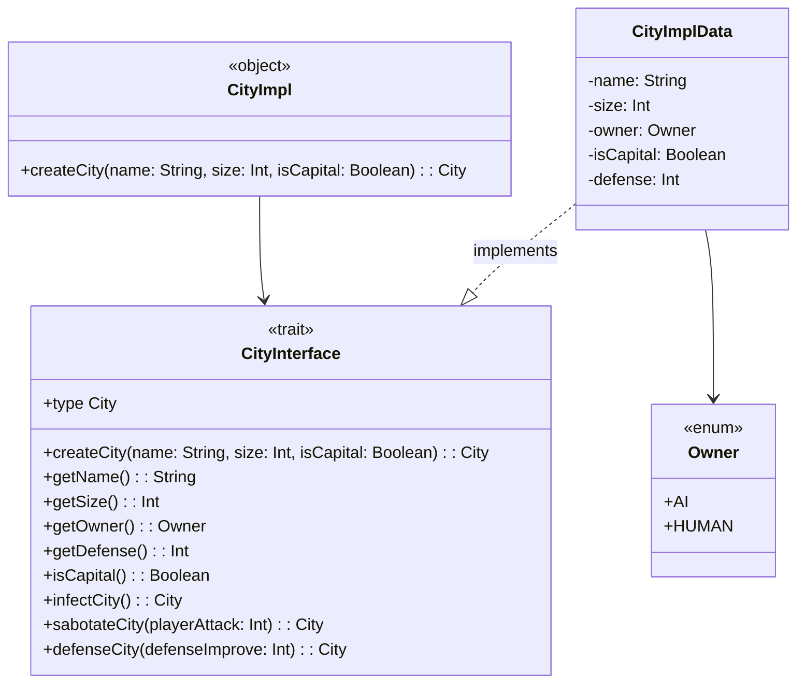

# `CityModule`

## Descrizione

Il modulo `CityModule` rappresenta la logica relativa alla gestione delle città all'interno del gioco,
modellando proprietà come nome, dimensione, possessore della città (umano o IA),
difesa e se nel gioco viene definita come capitale. 
È possibile creare città, infettarle (trasformandole in città dell'IA), sabotarle o rafforzarne la difesa.


È progettato con un approccio funzionale, sfruttando tipi opachi per incapsulare i dettagli interni 
e mantenere l’immutabilità. Le funzionalità sono fornite tramite metodi di estensione, 
permettendo un'interfaccia pulita e intuitiva.

---

## Caratteristiche funzionali

* **ADT (Algebraic Data Types)**: utilizzo di `enum` per rappresentare il tipo di proprietario (`Owner`), migliorando la sicurezza del tipo.
* **Tipi opachi (`opaque type`)**: incapsulamento dell’implementazione interna di `City`, nascondendola all’esterno.
* **Metodi di estensione (`extension`)**: permettono di definire operazioni su `City` come se fossero metodi dell’oggetto stesso.
* **Pattern immutabile**: ogni modifica (es. infezione, sabotaggio) restituisce una nuova istanza della città, rispettando il paradigma funzionale.
* **Utilizzo del `trait` per l’interfaccia**: separazione tra definizione dell’interfaccia (`CityInterface`) e implementazione concreta (`CityImpl`).
* **Scala 3 syntax**

---

## Diagramma delle classi




# `WorldMapModule`

## Descrizione

Il modulo `WorldMapModule` definisce la rappresentazione e le logiche di costruzione della mappa di gioco. 
Ogni mappa è costituita da un insieme di città, ognuna delle quali è associata a una serie di coordinate 
(o “tile”) che rappresentano la sua posizione spaziale. 
Il modulo supporta sia la creazione deterministica che quella casuale della mappa, 
offrendo metodi di accesso, aggiornamento e analisi dello stato della mappa.

---

## Caratteristiche funzionali

* **Tipo opaco (`opaque type`)**: l’intera mappa (`WorldMap`) è incapsulata come un set opaco di coppie (Città, Coordinate), migliorando la sicurezza del tipo e l’incapsulamento.
* **Trait astratto**: `CreateModuleType` definisce un'interfaccia per strategie di costruzione della mappa.
* **Implementazioni modulari**:
    * `DeterministicMapModule`: costruzione ordinata e prevedibile.
    * `UndeterministicMapModule`: costruzione casuale usando monadi di stato e generatore pseudo-casuale.
* **Uso della `State` monad**: gestisce lo stato interno del generatore di numeri casuali senza effetti collaterali.
* **Ricorsione con `@tailrec`**: garantisce efficienza e sicurezza durante l’espansione delle città nella mappa.
* **Estensioni su `WorldMap`**: metodi di accesso e modifica funzionale della mappa, come ricerca di città, conteggio, sostituzione, rilevamento di città adiacenti infette.

---

## Diagramma delle classi


# `GameController`

## Descrizione

Il modulo `GameController` funge da punto centrale per la gestione del ciclo di gioco. Si occupa di utilizzare i componenti core (modello, vista) e orchestrare il turno di gioco,
in cui l'intelligenza artificiale compie un'azione, seguita da un'azione del giocatore umano. 
Utilizza la monade `State` per mantenere e aggiornare in modo funzionale lo stato globale del gioco (`GameState`).

---

## Caratteristiche funzionali

* **`GameState`**: opaque type che incapsula lo stato del mondo (`WorldState`), servendo da contesto per l'intero flusso di gioco.
* **Monade `State`**: tutte le azioni (IA, giocatore, rendering) sono modellate come trasformazioni pure dello stato, promuovendo testabilità e immutabilità.
* **Turno di gioco**:

    1. Rendering e input da parte dell’utente.
    2. Esecuzione dell’azione dell’IA(se il calcolo della probabilità di riuscita da esito positivo).
    3. Esecuzione dell’azione difensiva umana.
  4. 
* **Sistema di input resiliente**: gestisce input non validi ricorsivamente (funzione `renderTurn`).
* **Estensibilità**: l’uso di  `AiAction`, `HumanAction`e `GameView` come astrazioni facilita l'aggiunta di nuove strategie o modalità di interfaccia utente.

---

## Diagramma Delle Classi

```mermaid
classDiagram
    class GameController {
        <<object>>
        +buildGameState(): GameState
        +gameTurn(): State[GameState, Unit]
    }

    class GameStateImpl {
        +worldState: WorldState
    }

    class GameState {
        <<opaque type>>
        type = GameStateImpl
    }

    class TurnResult {
        -playerAction: AiAction
        -playerProb: Int
        -humanAction: Option~HumanAction~
    }

    class AiAction
    class HumanAction
    class State~S, A~
    class WorldState
    class GameSettings
    class CLIView

    GameController --> GameState : defines
    GameController --> GameStateImpl : wraps
    GameController --> TurnResult : uses
    GameController --> WorldState : uses
    GameController --> State : functional core
    GameController --> CLIView : renders
    GameController --> GameSettings : uses
    GameController --> AiAction : uses
    GameController --> HumanAction : uses

    GameStateImpl --> WorldState : contains
    GameState --> GameStateImpl : opaque
    GameController --> "renderTurn()" : invokes
    GameController --> "doPlayerAction()" : invokes
    GameController --> "doHumanAction()" : invokes
```


