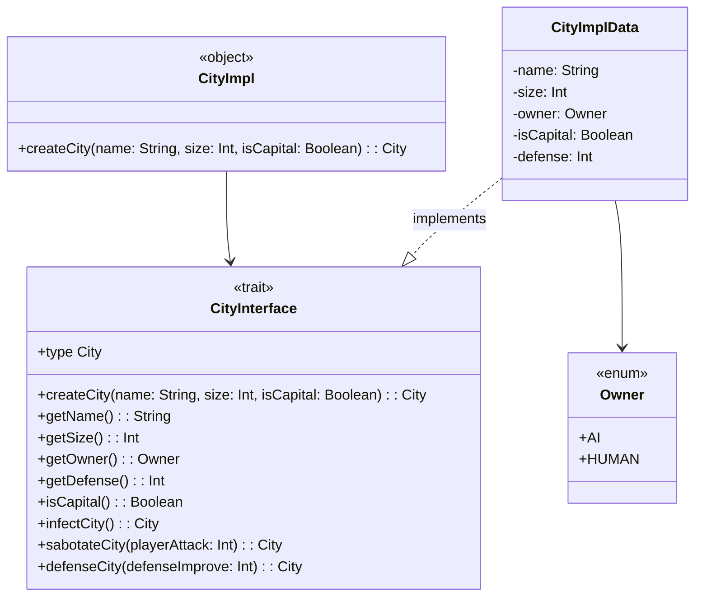
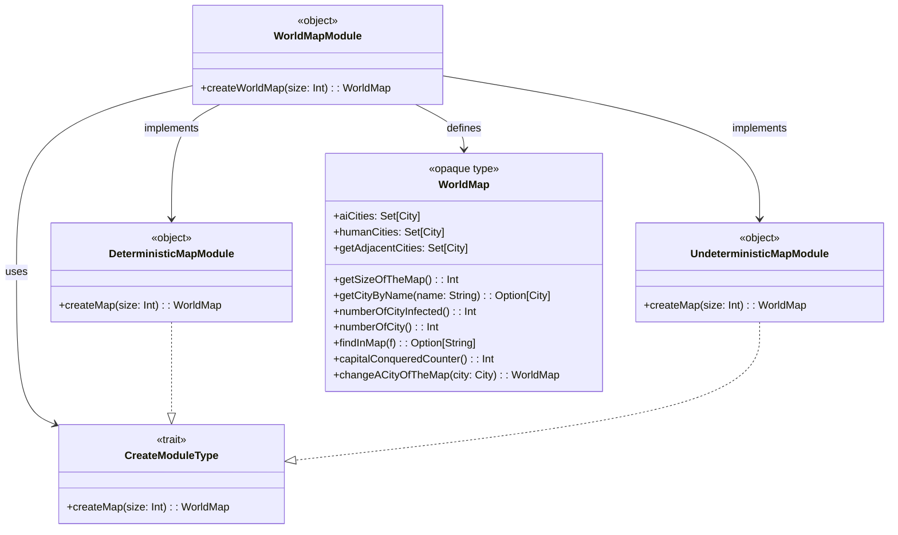
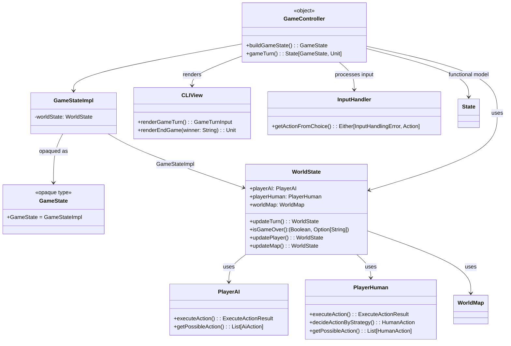

# Model

## Abstract

In questa parte si troveranno le parti di codice sviluppate da Luca Pasini.
I moduli principali includono:

* `CityModule`: gestione dello stato e delle operazioni sulle città;
* `WorldMapModule`: costruzione e manipolazione della mappa di gioco;
* `GameController`: coordinamento del flusso di gioco e delle interazioni tra i componenti.

## `CityModule`

### Descrizione

Il modulo `CityModule` rappresenta la logica relativa alla gestione delle città all'interno del gioco,
modellando proprietà come nome, dimensione, possessore della città (umano o IA),
difesa e se nel gioco viene definita come capitale. 
È possibile creare città, infettarle (trasformandole in città dell'IA), sabotarle o rafforzarne la difesa.

È progettato con un approccio funzionale, sfruttando tipi opachi per incapsulare i dettagli interni 
e mantenere l’immutabilità. Le funzionalità sono fornite tramite metodi di estensione, 
permettendo un'interfaccia pulita e intuitiva.

---

### Caratteristiche funzionali

* **ADT (Algebraic Data Types)**: utilizzo di `enum` per rappresentare il tipo di proprietario (`Owner`), migliorando la sicurezza del tipo.
* **Tipi opachi (`opaque type`)**: incapsulamento dell’implementazione interna di `City`, nascondendola all’esterno.
* **Metodi di estensione (`extension`)**: permettono di definire operazioni su `City` come se fossero metodi dell’oggetto stesso.
* **Pattern immutabile**: ogni modifica (es. infezione, sabotaggio) restituisce una nuova istanza della città, rispettando il paradigma funzionale.
* **Utilizzo del `trait` per l’interfaccia**: separazione tra definizione dell’interfaccia (`CityInterface`) e implementazione concreta (`CityImpl`).

### Metodi presenti

| Metodo                              | Descrizione                                                           |
|-------------------------------------|-----------------------------------------------------------------------|
| `createCity(name, size, isCapital)` | Crea una nuova città con nome, dimensione e indicazione se è capitale |
| `getName`                           | Restituisce il nome della città                                       | 
| `getSize`                           | Restituisce la dimensione della città                                 | 
| `getOwner`                          | Restituisce il proprietario attuale della città (`AI` o `HUMAN`)      | 
| `getDefense`                        | Calcola la difesa totale della città                                  |
| `isCapital`                         | Indica se la città è una capitale                                     |
| `infectCity()`                      | Cambia il proprietario della città in `AI`                            | 
| `sabotateCity(playerAttack)`        | Riduce la difesa della città di un valore passato                     | 
| `defenseCity(defenseImprove)`       | Aumenta la difesa della città di un valore passato                    | 

---

### Diagramma delle classi

## `WorldMapModule`

### Descrizione

Il modulo `WorldMapModule` definisce la rappresentazione e le logiche di costruzione della mappa di gioco. 
Ogni mappa è costituita da un insieme di città, ognuna delle quali è associata a una serie di coordinate 
 che rappresentano la sua posizione spaziale. 
Il modulo supporta sia la creazione deterministica che quella casuale della mappa, 
offrendo metodi di accesso, aggiornamento e analisi dello stato della mappa.

---

### WorldMap type
* La scelta di definire `WorldMap` come `opaque type WorldMap = Set[(City, Set[Coord])]` consente di rappresentare la mappa come un'associazione diretta tra ogni città e le sue coordinate spaziali.
* `Coord` è definito come una tupla `(Int, Int)` e rappresenta una singola cella della griglia di gioco, utile per localizzare le città sulla mappa.

---

### Caratteristiche funzionali o avanzate

* **Tipo opaco (`opaque type`)**: l’intera mappa (`WorldMap`) è incapsulata come un set opaco di coppie (Città, Coordinate), migliorando la sicurezza del tipo e l’incapsulamento.
* **Trait astratto**: `CreateModuleType` definisce un'interfaccia per strategie di costruzione della mappa.
* **Implementazioni modulari**:
    * `DeterministicMapModule`: costruzione ordinata e prevedibile attraverso metodi ricorsivi tail, modulo pensato soprattutto per la fase di testing.
    * `UndeterministicMapModule`: costruzione pseudo-casuale della mappa tramite una `LazyList`, che permette la generazione differita delle mappe fino a trovare una configurazione valida secondo i vincoli specificati. 
* **Ricorsione con `@tailrec`**: garantisce efficienza durante l’espansione delle città nella mappa, modulo utilizzato in produzione.
* **Estensioni su `WorldMap`**: metodi forniti a coloro che andranno ad utilizzare questo tipo di dato consentendo la possibilità di accesso e modifica funzionale della mappa, come ricerca di città, conteggio, sostituzione, rilevamento di città adiacenti infette.
* **Utilizzo di given**: decisione del modulo di costruzione della mappa grazie ai given
* **Utilizzo di for..yeld monadici**: utlizzo di for..yeld monadici in diverse parti del codice come la creazione della mappa non deterministica con le `LazyList` oppure per la decisione degli diacenti e la cotruzione di set di coordinate.

---

### Metodi presenti

| Metodo                        | Descrizione                                                            |
| ----------------------------- | ---------------------------------------------------------------------- |
| `getSizeOfTheMap`             | Calcola la dimensione massima della griglia a partire dalle coordinate |
| `getCityByName(name: String)` | Ritorna la città con nome corrispondente, se esiste                    |
| `numberOfCityInfected()`      | Conta le città controllate dall’AI                                     |
| `numberOfCity()`              | Ritorna il numero totale di città                                      |
| `findInMap(f)`                | Trova la prima città che soddisfa un predicato                         |
| `aiCities`                    | Restituisce tutte le città controllate dall’AI                         |
| `humanCities`                 | Restituisce tutte le città controllate dall’umano                      |
| `capitalConqueredCounter`     | Conta le capitali conquistate dall’AI                                  |
| `getAdjacentCities`           | Trova le città umane adiacenti a quelle infette                        |
| `changeACityOfTheMap(city)`   | Sostituisce una città con una nuova istanza mantenendone le coordinate |

---

### Diagramma delle classi

# Controller

## `GameController`

### Descrizione

Il modulo `GameController` rappresenta il punto di orchestrazione principale dell'intero flusso di gioco. 
Coordina:
- La generazione dello stato iniziale del mondo (`WorldState`)
- Le azioni dell'intelligenza artificiale (`PlayerAI`)
- Le decisioni del giocatore umano (`PlayerHuman`)
- L’interazione tramite interfaccia (CLI)
- Le logiche del GameSetting nel turno di gioco

Utilizza la monade `State` per mantenere e aggiornare in modo funzionale lo stato globale del gioco (`GameState`).

---

### Caratteristiche funzionali o avanzate

* **`GameState`**: opaque type che incapsula lo stato del mondo (`WorldState`), servendo da contesto per l'intero flusso di gioco.
* **Monade `State`**: tutte le azioni (IA, giocatore, rendering) sono modellate come trasformazioni pure dello stato, promuovendo testabilità e immutabilità.
* **Sistema di input resiliente**: gestisce input non validi ricorsivamente (funzione `renderTurn`).
* **Estensibilità**: l’uso di  `AiAction`, `HumanAction`e `GameView` come astrazioni facilita l'aggiunta di nuove strategie o modalità di interfaccia utente.

---

### Turno di gioco

  1. Rendering e input da parte dell’utente.
  2. Esecuzione dell’azione dell’IA(se il calcolo della probabilità di riuscita da esito positivo) richiamando il metodo ExecuteAction di PlayerAI.
  3. Esecuzione dell’azione difensiva umana (da parte del computer con una logica basata sulla difficoltà oppure con l'input dell'utente in caso della modalità multiplyer)  richiamando il metodo ExecuteAction di PlayerHuman.

---

### Diagramma Delle Classi

