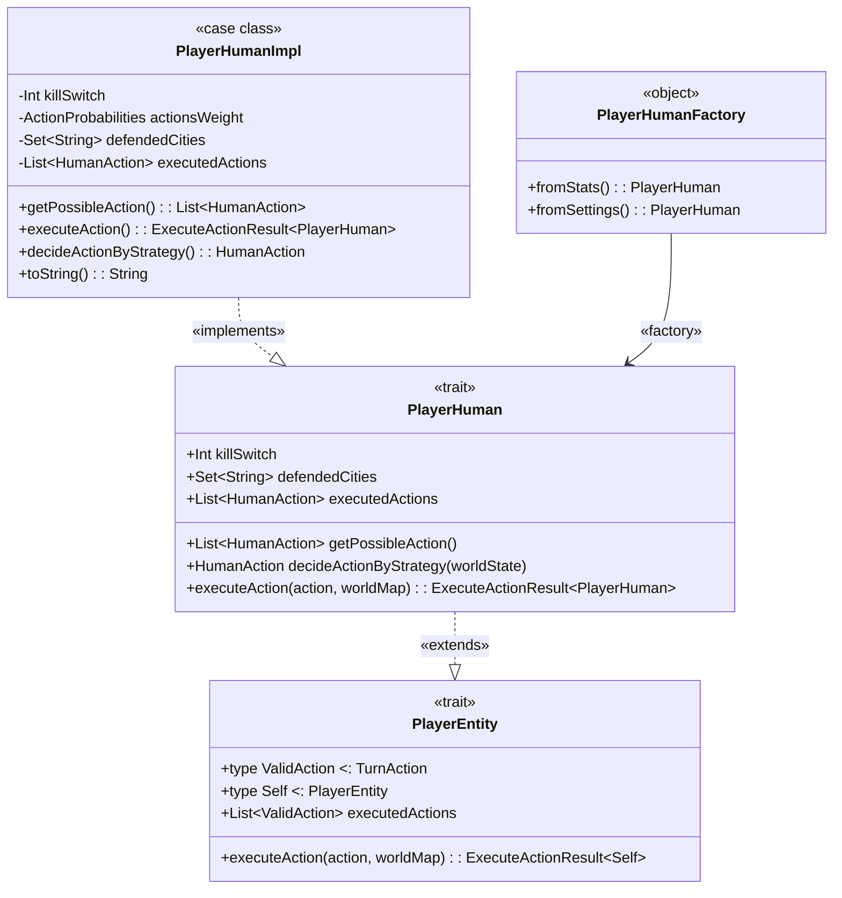
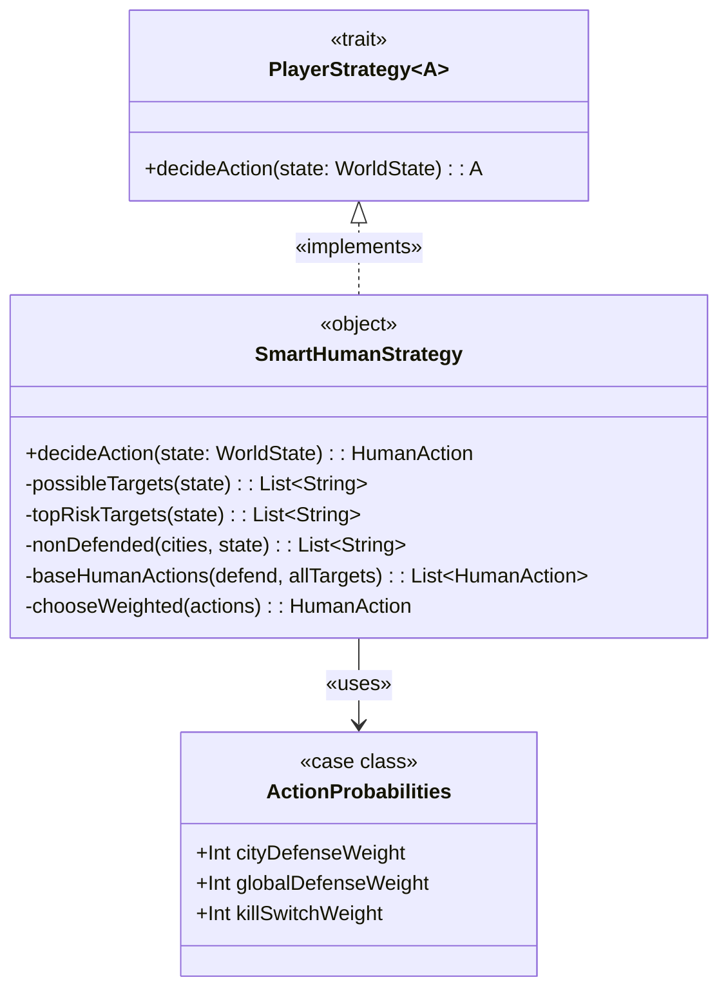
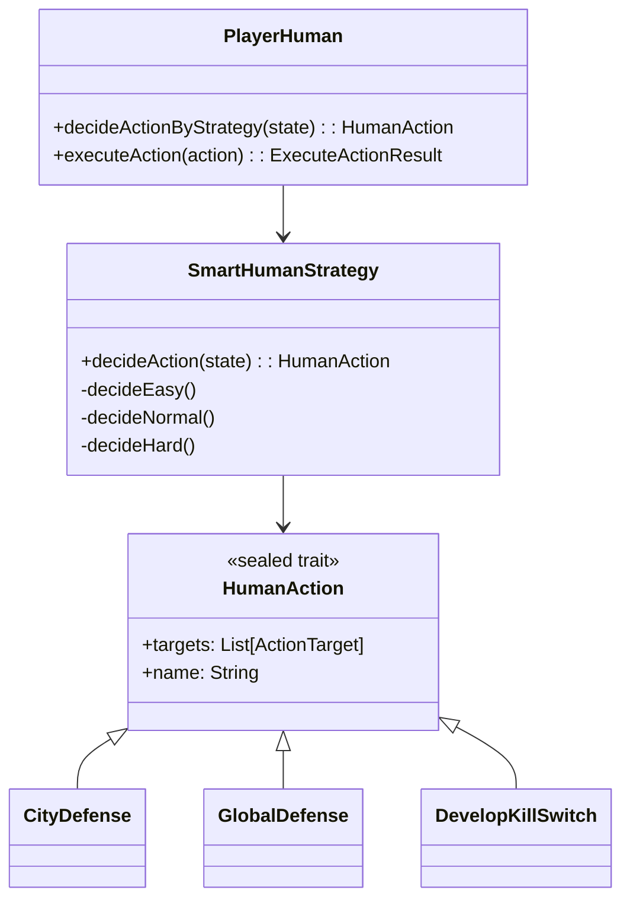

# Entità di gioco Human

## PlayerHuman
PlayerHuman rappresenta il giocatore umano in gioco, implementando un insieme di funzionalità tipiche 
del comportamento umano assistito da una strategia intelligente.

Estende PlayerEntity, condividendo l'interfaccia comune con altre entità (es. IA).
Le azioni disponibili e l’interazione con il mondo sono modellate in modo esplicito.

È supportato un comportamento strategico tramite SmartHumanStrategy.

### Aspetti implementativi
- Pattern usati:
  - Trait + Impl + Companion Object:Uso del trait PlayerHuman con una implementazione concreta 
  PlayerHumanImpl e un companion object per factory methods (fromStats, fromSettings).

  - Strategy Pattern: decideActionByStrategy(worldState) usa SmartHumanStrategy, 
  permettendo comportamenti dinamici configurabili.

  - Immutable Data Structures: case class con metodi copy(...) per generare nuove istanze
  in seguito a modifiche (programmazione funzionale).

- Scelte architetturali:
  - Le azioni sono fortemente tipizzate tramite HumanAction, separate in sottotipi come CityDefense, 
  GlobalDefense, DevelopKillSwitch.

  - Ogni executeAction produce un ExecuteActionResult, incapsulando il risultato e i cambiamenti sul mondo.

### Funzionalità principali
| Funzionalità             | Descrizione                                                                |
|--------------------------| -------------------------------------------------------------------------- |
| `killSwitch`             | Tiene traccia del progresso nello sviluppo di una super arma (kill switch) |
| `defendedCities`         | Città attualmente difese dal giocatore                                     |
| `executedActions`        | Storico delle azioni eseguite                                              |
| `getPossibleAction`      | Ritorna l'elenco di azioni disponibili                                     |
| `decideActionByStrategy` | Sceglie un’azione basata sullo stato del mondo e una strategia configurata |
| `executeAction(action)`  | Applica gli effetti dell’azione al player e alla mappa                     |
| `fromSettings`           | Costruttori statici per inizializzare il player                            |
| `toString`               | Rappresentazione testuale dello stato del player                           |

### Diagramma delle classi

## PlayerStrategy
PlayerStrategy rappresenta un'interfaccia generica per qualsiasi strategia di gioco che possa decidere un'azione
(TurnAction) in base allo stato attuale del mondo (WorldState). È progettata per supportare decisioni sia umane 
che artificiali.

L'oggetto SmartHumanStrategy fornisce un'implementazione concreta pensata per il giocatore umano, 
con logiche di scelta influenzate dalla difficoltà del gioco (Easy, Normal, Hard), pesando le diverse azioni disponibili.

### Aspetti implementativi
- **Pattern e Tecniche Utilizzate**

  - Strategy Pattern: PlayerStrategy è un trait parametrico che permette di definire strategie intercambiabili 
  per agenti diversi.

  - Weighted Random Selection: SmartHumanStrategy usa una selezione casuale pesata per scegliere un’azione, 
  guidata da ActionProbabilities.

  - Pattern Matching e Filtering: selezione delle città e delle azioni tramite pattern e trasformazioni 
  funzionali (map/filter/sort).

  - Functional Programming: immutabilità e uso di costrutti come Option.when, collect, scanLeft, ecc.

- **Aspetti implementativi `SmartHumanStrategy`**:

  - La decisione viene determinata dalla funzione `decideAction(state: WorldState)`, che sceglie tra tre varianti:
    - **Easy** → difensiva e passiva (priorità alla CityDefense e GlobalDefense)
    - **Normal** → scelta casuale tra tutte le azioni disponibili
    - **Hard** → priorità alle città più a rischio e azioni più aggressive
    
  - Le azioni disponibili sono definite nel sealed trait `HumanAction`, che include:
    - `CityDefense`
    - `GlobalDefense`
    - `DevelopKillSwitch`
    
  - Il modulo `PlayerHuman` utilizza `SmartHumanStrategy` come strategia di default. 

### Funzionalità principali

| Componente            | Funzione                                                     |
| --------------------- | ------------------------------------------------------------ |
| `ActionProbabilities` | Contiene i pesi (priorità) per ciascuna azione umana         |
| `PlayerStrategy[A]`   | Trait generico per strategie di azione                       |
| `SmartHumanStrategy`  | Strategia concreta per il giocatore umano                    |
| `decideAction(state)` | Seleziona un’azione in base allo stato del mondo             |
| `possibleTargets`     | Ritorna le città attaccabili senza ordinamento               |
| `topRiskTargets`      | Ordina le città in base al rischio di infezione + sabotaggio |
| `nonDefended`         | Filtra le città già difese dal giocatore                     |
| `baseHumanActions`    | Costruisce la lista di azioni disponibili                    |
| `chooseWeighted`      | Algoritmo di selezione pesata tra azioni                     |

### Diagramma delle classi

### Diagramma delle classi PlayerHuman-SmartHumanStrategy

