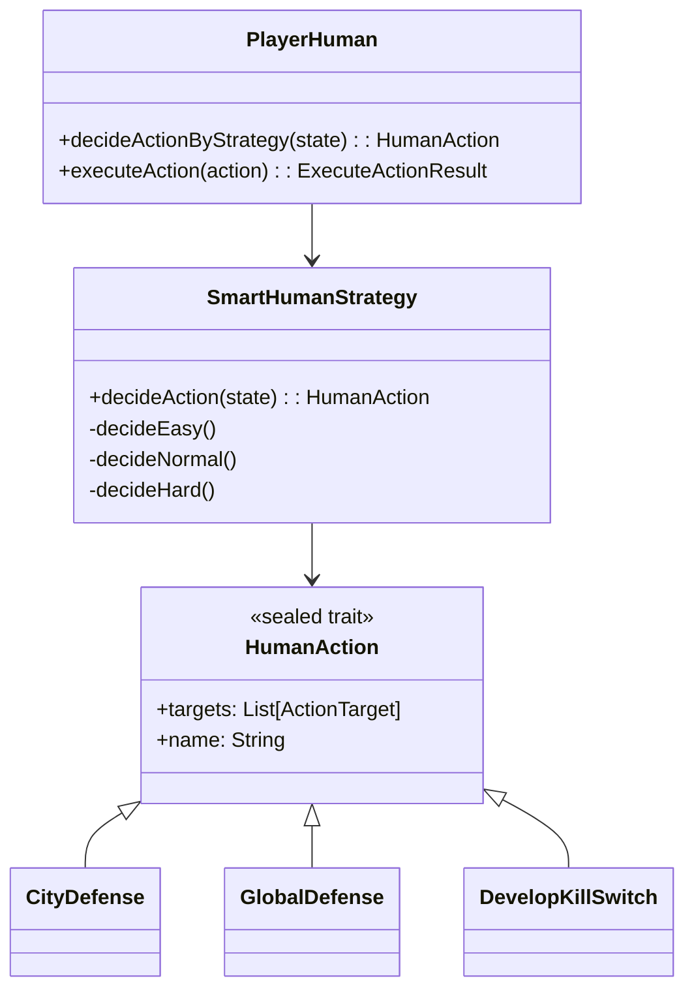

# Entità di gioco Human

## Descrizione

Il modulo che gestisce la strategia del **giocatore umano** definisce come l’entità Human Player prenda 
decisioni in base allo stato del mondo. Il comportamento si adatta dinamicamente in base alla 
**difficoltà selezionata** (Easy, Normal, Hard), offrendo vari livelli di difesa e sviluppo.

La strategia umana è integrata tramite un'implementazione del trait `PlayerStrategy[HumanAction]`, 
e viene invocata da `PlayerHuman` per determinare l'azione da compiere.

---

## Aspetti implementativi

- La strategia è definita nel singleton `SmartHumanStrategy`, che implementa l’interfaccia generica `PlayerStrategy[A]`.
- La decisione viene determinata dalla funzione `decideAction(state: WorldState)`, che sceglie tra tre varianti:
    - **Easy** → difensiva e passiva (priorità alla CityDefense e GlobalDefense)
    - **Normal** → scelta casuale tra tutte le azioni disponibili
    - **Hard** → priorità alle città più a rischio e azioni più aggressive
- Le azioni disponibili sono definite nel sealed trait `HumanAction`, che include:
    - `CityDefense`
    - `GlobalDefense`
    - `DevelopKillSwitch`
- Il modulo `PlayerHuman` utilizza `SmartHumanStrategy` come strategia di default.

---

## 🔧 Funzionalità principali

| Componente                  | Descrizione                                                                |
|-----------------------------|----------------------------------------------------------------------------|
| `decideAction`              | Metodo centrale che sceglie l’azione sulla base del `WorldState`           |
| `topRiskTargets`            | Calcola le città con il rischio più alto (somma di sabotaggio e infezione) |
| `nonDefended`               | Filtra le città non ancora difese                                          |
| `baseHumanActions`          | Costruisce la lista completa delle azioni umane possibili                  |
| `PlayerHuman.executeAction` | Esegue logicamente l’effetto di un’azione sullo stato del mondo            |
| `killSwitch`                | Rappresenta l’avanzamento nella cura per fermare l’AI                      |

---

## Diagramma dei componenti

