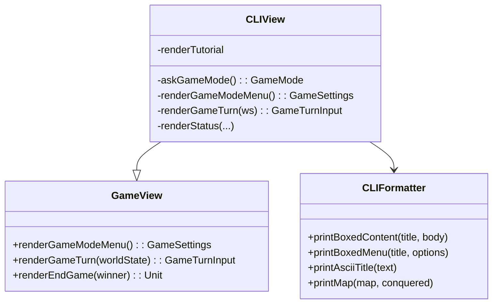

# Sistema di Visualizzazione - CLIView

## Descrizione
Il modulo `CLIView`, contenuto in `ViewModule.scala`, rappresenta la **vista testuale** del gioco *Rise of the Machine*.
Implementa l'interfaccia `GameView` e consente l'interazione con il giocatore attraverso il terminale. 
Ogni fase del gioco (menu, turni, stato, azioni) è resa accessibile tramite un'interfaccia utente testuale chiara e 
coerente.

---

## Aspetti Implementativi

- Utilizza il pattern **strategy-view**, separando la logica del gioco dalla presentazione.
- Implementa `GameView` come interfaccia funzionale, rendendo facile sostituire la vista CLI con altre (es. GUI).
- Le funzionalità CLI sono modulari grazie a `CLIFormatter`, che offre:
    - Menu formattati (`printBoxedMenu`)
    - Blocchi informativi (`printBoxedContent`)
    - ASCII art del titolo (`printAsciiTitle`)
    - Mappa dinamica (`printMap`)

- Usa funzioni **ricorsive** con `@tailrec` per rendere la logica dei menu robusta e priva di mutabilità (`askGameMode()`).
- Input utente gestito con pattern matching e fallback intelligenti.
- Il sistema è **completamente testabile** grazie alla separazione `input/output`.

---

## Funzioni principali

| Metodo | Descrizione |
|--------|-------------|
| `renderGameModeMenu()` | Mostra il menu principale e gestisce la selezione della modalità e difficoltà |
| `askGameMode()` | Funzione ricorsiva tail-safe per la selezione della modalità |
| `renderGameTurn()` | Mostra la mappa, lo stato del gioco e chiede le azioni a IA e giocatore |
| `renderStatus()` | Visualizza il progresso di infezione, KillSwitch e abilità AI |
| `renderProbability()` | Mostra probabilità di attacco su città vicine |
| `renderComplessiveAction()` | Riepiloga le ultime azioni umane e AI |
| `renderTutorial()` | Mostra guida rapida al gioco in stile terminale |
| `printBoxedMenu() / printBoxedContent()` | Fornite da `CLIFormatter`, rendono l’interfaccia coerente e leggibile |

---

## Diagramma dei componenti

