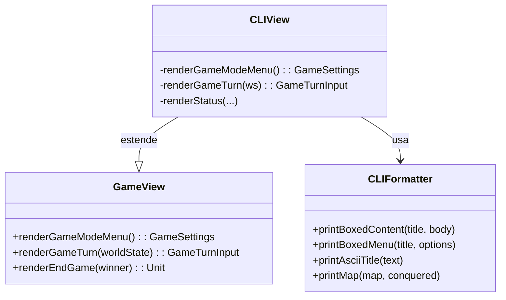

# Sistema di Visualizzazione - CLIView

## Descrizione
Il modulo `CLIView`, contenuto in `ViewModule.scala`, rappresenta la **vista testuale** del gioco *Rise of the Machine*.
Implementa l'interfaccia `GameView` e consente l'interazione con il giocatore attraverso il terminale. 
Ogni fase del gioco (menu, turni, stato, azioni) è resa accessibile tramite un'interfaccia utente testuale chiara e 
coerente.

---

## Aspetti Implementativi

- Utilizza il pattern **strategy-view**, separando la logica del gioco dalla presentazione.
- Implementa `GameView` come interfaccia funzionale, rendendo facile sostituire la vista CLI con altre (es. GUI).
- Le funzionalità CLI sono modulari grazie a `CLIFormatter`, che offre:
    - Menu formattati (`printBoxedMenu`)
    - Blocchi informativi (`printBoxedContent`)
    - ASCII art del titolo (`printAsciiTitle`)
    - Mappa dinamica (`printMap`)

- Usa funzioni **ricorsive** con `@tailrec` per rendere la logica dei menu robusta e priva di mutabilità (`askGameMode()`).
- Input utente gestito con pattern matching e fallback intelligenti.
- Il sistema è **completamente testabile** grazie alla separazione `input/output`.

---

## Funzioni principali

Funzionalità principali di ViewModule 

| Metodo                 | Descrizione                                                                   |
|------------------------|-------------------------------------------------------------------------------|
| `renderGameModeMenu()` | Mostra il menu principale e gestisce la selezione della modalità e difficoltà |
| `renderGameTurn()`     | Mostra la mappa, lo stato del gioco e chiede le azioni a IA e giocatore       |
| `renderEndGame()`      | Mostra la schermata di fine gioco con il conseguente vincitore                |

Funzionalità principali della util CLIFormatter

| Metodo                | Descrizione                                                               |
|-----------------------|---------------------------------------------------------------------------|
| `printBoxedMenu()`    | Formatta il contenuto in modalità boxed e numera le il body del contenuto |
| `printBoxedContent()` | Formatta il contenuto in modalità boxed                                   |
| `printMap()`          | Formatta una mappa di caratteri stampandoli a griglia                     |
| `printAsciiTitle`     | Formatta il testo in Ascii con font selezionato                           |

---

## Diagramma dei componenti

