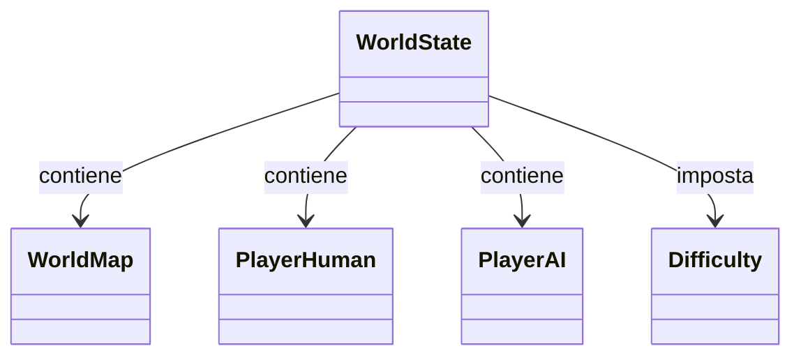

## Descrizione
Il modulo `WorldState` rappresenta lo stato globale del gioco a ogni turno. Include informazioni su:

- la mappa del mondo (`WorldMap`)
- i due giocatori (umano e AI)
- la difficoltà selezionata
- il numero del turno attuale
- la condizione di fine partita

L’obiettivo è fornire una **visione immutabile e coerente** dello stato del gioco, accessibile solo tramite 
metodi estensivi sicuri.
---

## Aspetti implementativi

- Il tipo `WorldState` è definito come **opaque type**, per proteggere l’incapsulamento interno.
- La struttura interna è basata su un `enum` con un solo caso: `State(...)`.
- Le funzionalità sono esposte tramite **extension methods**, per mantenere il tipo chiuso all’esterno.
- Le logiche implementate includono:
    - Calcolo del game over
    - Percentuali di successo di attacchi
    - Aggiornamento dei componenti (mappa, giocatori, turno)
    - Supporto per strategie IA e umane

---

### Funzionalità principali
| Metodo | Descrizione |
|--------|-------------|
| `attackableCities` | Restituisce le città attaccabili con probabilità di infezione e sabotaggio |
| `isGameOver` | Determina se il gioco è terminato, e chi ha vinto |
| `updateMap` | Permette di aggiornare le città nella mappa |
| `updateTurn` | Avanza il turno di gioco |
| `AIUnlockedAbilities` | Recupera le abilità sbloccate dall’IA |

---

## Diagramma dei componenti

